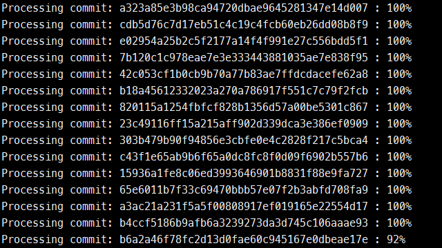

# GitHub Repo Java Method Analyzer
This program analyzes the increases of the parameters of the method declarations of Java source files in the commits of the master branch of any GitHub repository.


## Objectives
Say, you have edited your Java file `src/MyFile.java` to change a method signature from `void doTask(int x)` into `void doTask(int x, String y)` in a commit (SHA: `0798eaa`) of your repository `your-username/your-repo` hosted on GitHub. Now if you run **GitHub Repo Java Method Analyzer** tool to analyze your repository, the tool will detect the method signature change, and it will report the change into a CSV file named `your-username_your-repo_methodAnalysis.csv`. The CSV file will contain the following information:

| Commit SHA    | Java File         | Old function signature   | New function signature   |
| :------------ | :---------------- | :----------------------- | :----------------------- |
| `0798eaa`     | `src/MyFile.java` | `void:doTask:int`        | `void:doTask:int,String` |


## Build Project
### Requirements:
- JDK 1.8 or later
- Maven, or any Java IDE which supports Maven

### Build steps:
1. If you want to use Maven directly (without any IDE), run the following command in the project directory where `pom.xml` file exists:
    ```posh
    mvn package
    ```
    Or, you can use any supported Java IDE (like IntelliJ, Eclipse) to build the project.

2. If the build process ends successfully, it will generate `github-repo-java-method-analyzer-1.0-SNAPSHOT.jar` file in `/target` directory.


## Run Project
To run the project, use the command in `/target` directory:
```posh
java -jar github-repo-java-method-analyzer-1.0-SNAPSHOT.jar
```
The program will show the following usage arguments:
```posh
repo_full_name [-u username password] [-p processed_commit_limit] [-t thread_count]
```
Here:
- `repo_full_name`: Use both owner's name and repo name like `google/guava`.

- `[-u username password]`: It is optional but recommended. GitHub API has a certain [rate limit](https://developer.github.com/v3/#rate-limiting). For unauthenticated requests (without using a username and its corresponding password/token), the rate limit allows for up to 60 requests per hour. For authenticated requests, the rate limit allows at least 5,000 requests per hour. The program uses 1 API call per processed commit. 

- `[-p processed_commit_limit]`: It is optional. You can enforce the program to limit how many commits to be processed. The program will start from the latest commit and process older commits one by one up to the limit. The default behavior of the program is to process all the commits of the `master` branch of a repository.

- `[-t thread_count]`: It is optional. You can enforce the program to use a certain number of threads to process each commit. A larger number of threads will be helpful for the commits which contain a lot of *eligible* files (*modified Java files*) per commit. But, by design, a larger number of threads will not be helpful for the commits which contain only a single *eligible* file per commit. The default behavior of the program is to use only a single thread to process each commit.

For example:
```posh
java -jar github-repo-java-method-analyzer-1.0-SNAPSHOT.jar google/guava -u yourname yourtoken -p 1000 -t 100
```

## Output
### Console output:
In the console, the program will provide a similar output of the following screenshot:



### File output:
The program will generate two files for each repository:

1. **CSV file:** It is the main output file. It has been already [stated](#objectives) that the CSV file will contain the following information:

    `Commit SHA`, `Java File`, `Old function signature`, `New function signature`

2. **State file:** This file is for the program's internal purpose. The file will contain the SHA value of the last processed commit. If you terminate the program, it will start from the commit stored in the file, instead of the latest commit.


## Sample Results
I have run the program to analyze the following repositories:
- [Google Guava](https://github.com/google/guava)
- [Apache Dubbo (incubating) Project](https://github.com/apache/incubator-dubbo)
- [Spring Boot](https://github.com/spring-projects/spring-boot)
- [JavaParser](https://github.com/javaparser/javaparser)

I have attached all the results of these repositories in [_SampleResults](/_SampleResults) directory.


## Acknowledgement
I would like to thank Professor [Dr. Sarah Nadi](https://sarahnadi.org), University of Alberta, for assigning me to do the project. I have learned a lot of things while working on the project.
